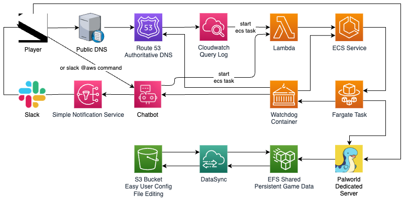
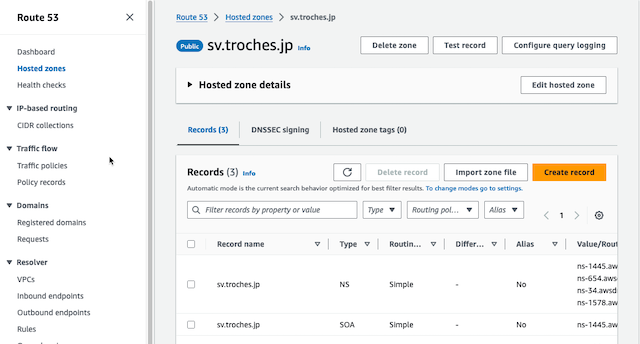
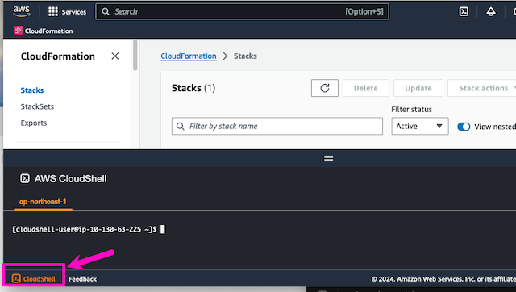
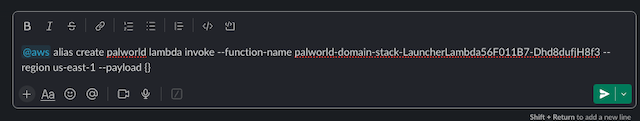
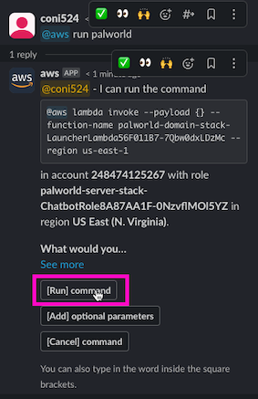

<div align="center">
  <a href="https://github.com/coni524/palworld-ondemand/stargazers"></a>
<a href="https://github.com/coni524/palworld-ondemand/network/members"></a>
<a href="https://github.com/coni524/palworld-ondemand/pulls"></a>
<a href="https://github.com/coni524/palworld-ondemand/issues"></a>
<a href="https://github.com/coni524/palworld-ondemand/graphs/contributors"></a>
<a href="https://github.com/coni524/palworld-ondemand/blob/master/LICENSE"></a>
</div>

# palworld-ondemand

オンデマンドの Palworld Dedicated Server （詳細省略版）

謝辞:

このプロジェクトは @doctorray117 によって作成された minecraft-ondemand プロジェクトにインスパイアされ、フォークとして作成しました。クラウドでオンデマンドに AWS Fargate を利用したゲームサーバーを動作させるという革新的なアイデアとその実装について、プロジェクトをオープンソースにして頂いた原作者と貢献者の方々に感謝いたします。

## 目次

- [palworld-ondemand](#palworld-ondemand)
  - [目次](#目次)
  - [要件](#要件)
  - [構成図](#構成図)
  - [コスト内訳](#コスト内訳)
  - [クイックスタート](#クイックスタート)
    - [1. Route 53](#1-route-53)
    - [2. AWS Chatbot](#2-aws-chatbot)
    - [3. コンフィグの設定とデプロイ](#3-コンフィグの設定とデプロイ)
    - [4. Slackエイリアスの設定](#4-slackエイリアスの設定)
    - [5. Palworld Dedicated Server を起動する](#5-palworld-dedicated-server-を起動する)
- [その他](#その他)
  - [README テンプレート](#readme-テンプレート)
  - [費用が心配な方へ](#費用が心配な方へ)
  - [不具合など](#不具合など)


## 要件

- AWSアカウント
- 独自ドメイン (お名前.com や ValueDomain などで取得するか 無料で運用できる Freenom を利用しても良いかもしれません)
- 所有するドメイン名に対してRoute53ゾーンの作成が完了していること [DNS served from Route 53]
- パルワールドのクライアント
- Slack と連携済みの AWS Chatbot [Get started with Slack]

## 構成図



## コスト内訳

- 月20時間の利用を想定した価格想定 [AWS Estimate]
- DNS ゾーンは月額 $0.50、Fargate の使用料は 1 時間あたり $0.29072（4vCPU、16GB メモリ）。その他のコストは少なく済みます。
- 4vCPU、16GBメモリ構成で20時間使用した場合、月額約5.81ドル、DNSゾーンに1ドル(1つのゾーンと本CDKで作成されるpalworld用ゾーンで合計2ゾーン)、合計で月額約 6〜7ドル程度

## クイックスタート
ドメイン取得、Route 53 ゾーン設定、AWS Chatbot と Slack の連携設定と、３つの手動設定が必要です。以降は AWS CloudShell 上で cdk よりデプロイします。

ローカル環境に追加のソフトウェアや、開発ツールのインストールは不要です。

### 1. Route 53
ドメインは取得済み。ホストゾーンはRoute53で作成済みであること。



### 2. AWS Chatbot
既存の Slack と　AWS Chatbot を連携させます。[Get started with Slack]


### 3. コンフィグの設定とデプロイ
AWS CloudShell のみでデプロイが可能です。



以下はAWS CloudShellを使った操作です。

Gitクローン
```
git clone https://github.com/coni524/palworld-ondemand.git
```

.env を編集する
```
cd palworld-ondemand/cdk/
cp -p .env.sample .env
vi .env
```

**必須フィールド**

- **DOMAIN_NAME** : ドメイン名 
- **SLACK_WORKSPACE_ID** ： AWS Chatbot Workspace ID
- **SLACK_CHANNEL_ID** ： Slack チャンネル ID、Slack チャンネルの View Channel defails より参照できます。
- **ADMIN_PASSWORD** ： RCON パスワード、接続ユーザーチェックのためにコンテナ内でのみ使用される。
- **SERVER_PASSWORD** ： Palworld Password, Palworldへのクライアント接続に必要なパスワード。
- **SERVER_REGION** ： Palworld 専用サーバーを起動するリージョン (例: 最寄りのリージョンを選択)

**.env** の例
```
# Required
DOMAIN_NAME                   = example.net
SLACK_WORKSPACE_ID            = T07RLAJDF
SLACK_CHANNEL_ID              = C06J8SWSKDJ
ADMIN_PASSWORD                = worldofpalrcon
SERVER_PASSWORD               = worldofpal
SERVER_REGION                 = ap-northeast-1
```

ビルドとデプロイ
```
npm run build && npm run deploy
```

### 4. Slackエイリアスの設定

awsをSlackチャンネルに招待する。

```
/invite @aws
```

Slackでエイリアスコマンドを作成する。"--function-name "には"...LauncherLambda... "というFunction名をus-east-1にセットして入力する。"--region "はus-east-1に固定。

```
@aws alias create palworld lambda invoke --function-name palworld-domain-stack-LauncherLambda56F011B7-DDFHHDNH8f3 --region us-east-1 --payload {}
```



### 5. Palworld Dedicated Server を起動する

Slackでコマンドを入力

```
@aws run palworld
```

Slackから応答があるので、"[Run] command "を押す。




数分後、Slack に起動完了のメッセージが表示され、接続できるようになります。

```
# パルワールドへ接続するサーバーとパスワードの例
palworld.example.net:8211
password: worldofpal
```

- 起動直後から10分間クライアントからの接続がない場合、システムは自動的に停止します。
- クライアントからの接続後、20分間接続ユーザがいないことを検知すると自動的に停止します。

# その他

## README テンプレート

[awesome-README-templates](https://github.com/elangosundar/awesome-README-templates?tab=readme-ov-file)

## 費用が心配な方へ

AWS の料金通知を利用することをおすすめします!! [Billing Alert]

## 不具合など

不具合やコメント/プルリクなどありましたらぜひお寄せください。

[Get started with Slack]: https://docs.aws.amazon.com/chatbot/latest/adminguide/slack-setup.html
[aws estimate]: https://calculator.aws/#/estimate?id=ebd1972b24b7d393610389a0017d3e1f8df2ed56
[dns served from route 53]: https://docs.aws.amazon.com/Route53/latest/DeveloperGuide/dns-configuring.html
[billing alert]: https://docs.aws.amazon.com/AmazonCloudWatch/latest/monitoring/monitor_estimated_charges_with_cloudwatch.html